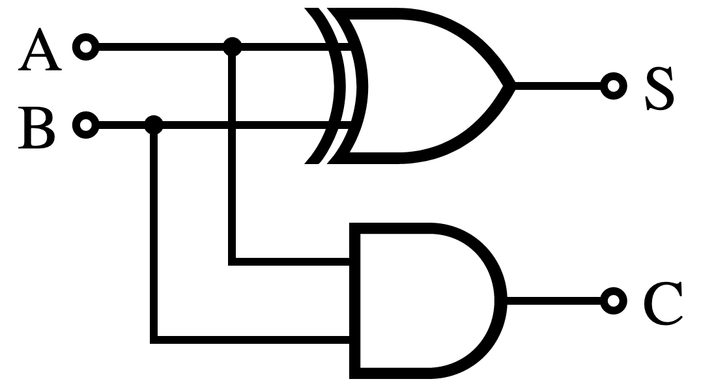
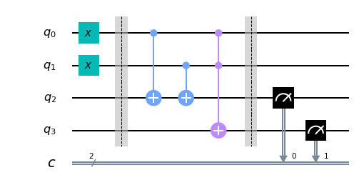

# the atoms of computation

## splitting information into bits

the first ting we need to know about is the idea of bits. these are designed to be the world's simplest alphabet. with only two char, 0 and 1. we can represent any piece information.

one example is number. you are probably used to representing a number through a string of the ten digits 0, 1, 2, 3, 4, 5, 6, 7, 8, and 9. in this string of digits, each digit representhow many times the number contains a certain power of ten for example when write 9213, we mean

9000 + 200 + 10 + 3

or, expresed in a way that emphasizes the power of ten

(9x10)^3 + (2x10^2) + (10x10^1) + (3x10^0)

though we usually use this system base on the number 19, we can just as easily use one based on any other number. the binary number system, for example, is based on number two, this means using the two caracters 0 and 1 to express number as multiples of powers of two, for example 9213 become ``10001111111101``

## computation as a diagram

Whether we are using qubits or bits, we need to manipulate them in order to turn the inputs we have into the outputs we need. For the simplest programs with very few bits, it is useful to represent this process in a diagram known as a circuit diagram. These have inputs on the left, outputs on the right, and operations represented by arcane symbols in between. These operations are called 'gates', mostly for historical reasons.

Here's an example of what a circuit looks like for standard, bit-based computers. You aren't expected to understand what it does. It should simply give you an idea of what these circuits look like.

For quantum computers, we use the same basic idea but have different conventions for how to represent inputs, outputs, and the symbols used for operations. Here is the quantum circuit that represents the same process as above.

