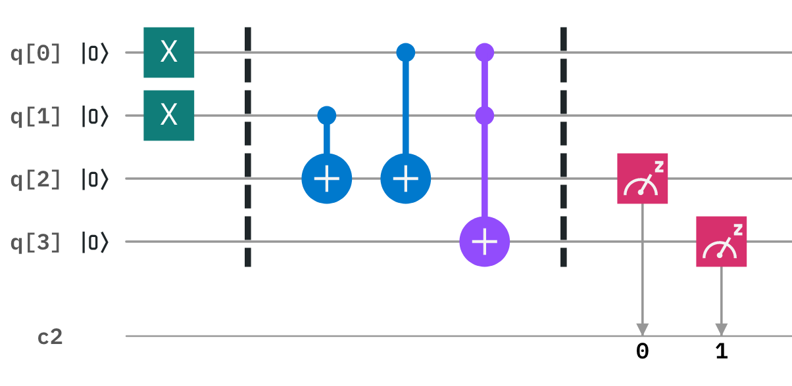
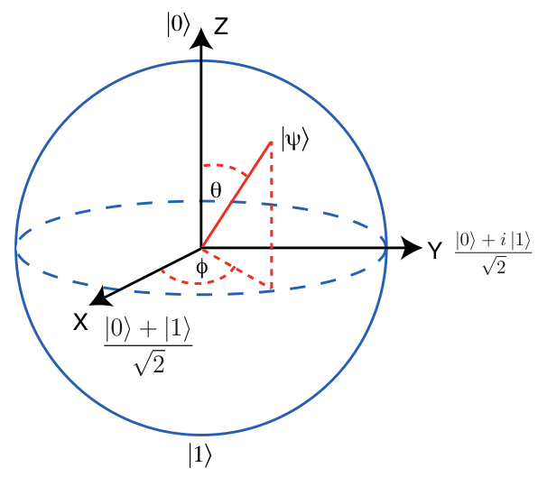

# introduction

if you think quantum mechanics sound challenging. all of our intuitions are based on day-to-day experiences, and so are better at understanding the behavior of balls and bananas than atoms or electorns, though quantum objects can seem random and chaotic at first, they just follow a different set of rules.once we know what thos rules are,wen can use them to create new and powerful technology. Quantum computing will be the most revolutionary example of this

to get you started on your journey towards quantum computing, let's what you already know. which of the following is the correct description of a _bit_?
- a blade used by a carpenter
- the smallest unit of information: either a 0 or a 1
- something you put in a horse's mouth.

Actually, they are all correct: it's a very multi-purpose word! But if you chose the second one, it shows that you are already thinking along the right lines. The idea that information can be stored and processed as a series of 0s and 1s is quite a big conceptual hurdle, but it's something most people today know without even thinking about it. Taking this as a starting point, we can start to imagine bits that obey the rules of quantum mechanics. These quantum bits, or qubits, will then allow us to process information in new and different ways.

We'll start diving deeper into the world of qubits. For this, we'll need some way of keeping track of what they are doing when we apply gates. The most powerful way to do this is to use the mathematical language of vectors and matrices.

