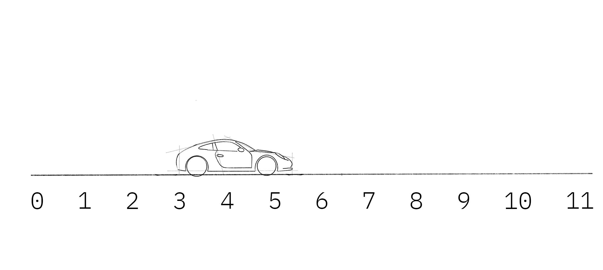
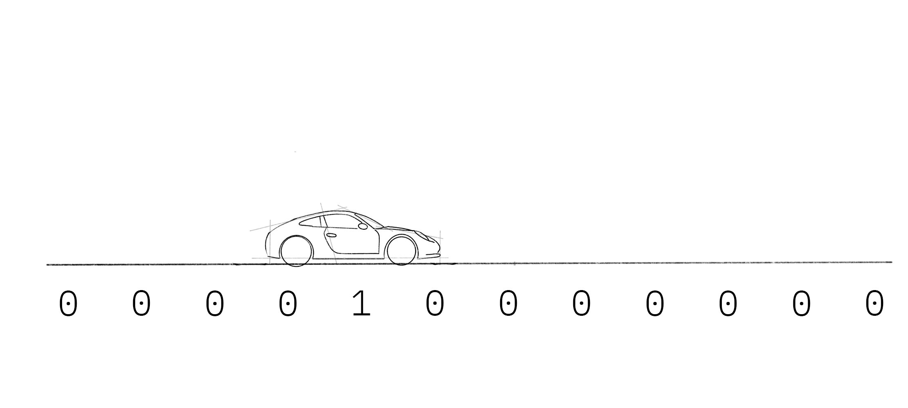
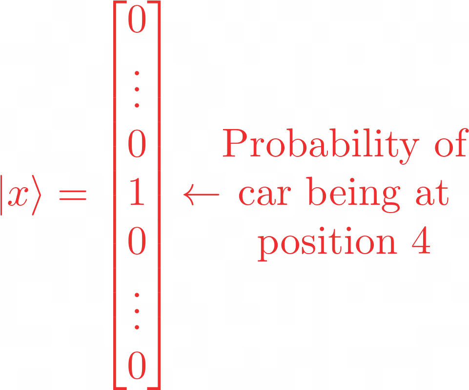

# Representing qubit states

You now know something about bits, and about how our familiar digital computers work. All the complex variables, objects and data structures used in modern software are basically all just big piles of bits. Those of us who work on quantum computing call these _classical variables_. The computers that use them, like the one you are using to read this article, we call _classical computers_.

In quantum computers, our basic variable is the qubit: a quantum variant of the bit. These have exactly the same restrictions as normal bits do: they can store only a single binary piece of information, and can only ever give us an output of 0 or 1. However, they can also be manipulated in ways that can only be described by quantum mechanics. This gives us new gates to play with, allowing us to find new ways to design algorithms.

## classical vs quantum bits

**statevectors**

In quantum physics we use statevectors to describe the state of our system. Say we wanted to describe the position of a car along a track, this is a classical system so we could use a number x



```
x = 4
```

Alternatively, we could instead use a collection of numbers in a vector called a statevector. Each element in the statevector contains the probability of finding the car in a certain place:





This isn’t limited to position, we could also keep a statevector of all the possible speeds the car could have, and all the possible colours the car could be. With classical systems (like the car example above), this is a silly thing to do as it requires keeping huge vectors when we only really need one number. But as we will see in this chapter, statevectors happen to be a very good way of keeping track of quantum systems, including quantum computers.


